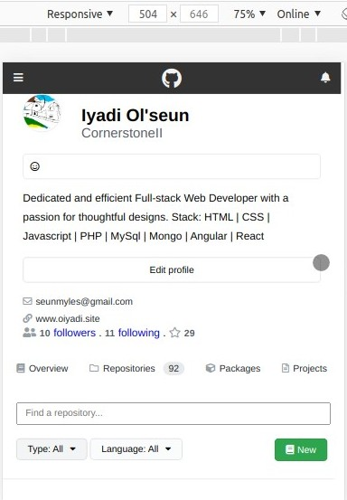
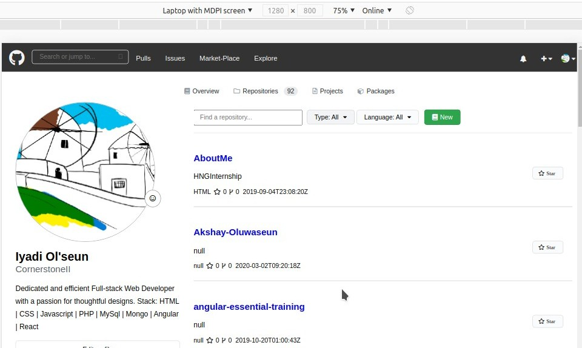

# BuyCoins-Frontend

> This project is about recreation (clone) of my github account, it also includes the display of a total maximum of 20 repositories using the graphql github API.





## Built With

- HTML5
- CSS3
- [GraphQL GitHub API](https://developer.github.com/v4/explorer/)
- Javascript (JQuery)

## Getting Started
[Demo](https://raw.githack.com/CornerstoneII/BuyCoins-Frontend/front-dev/index.html)

## Getting Started

To get a local copy up and running follow these simple example steps.

### Prerequisites

You need Live Server Ext. installed on your favorite code editor.

### Install

1) Open the Terminal
2) Run

```sh
git clone https://github.com/CornerstoneII/BuyCoins-Frontend.git
```

4) Run 'cd BuyCoins-Frontend' to enter the main directory'
5)  Right click on the

```sh
index.html
```

6) Select
```sh
Open with Live Server
```


## Author

👤 **Iyadi Oluwaseun**

- Github: [@CornerstoneII](https://github.com/CornerstoneII)
- Linkedin: [CornerstoneII](https://www.linkedin.com/in/oluwaseun-iyadi-773584b4/)


## 🤝 Contributing

Contributions, issues and feature requests are welcome!

Feel free to check the [issues page](issues/).

## Show your support

Give a ⭐️ if you like this project!

## Acknowledgments

- [Buy Coins](https://buycoins.africa/)

